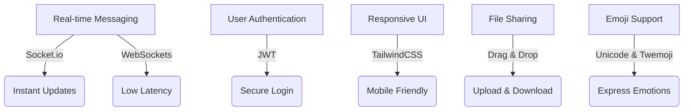
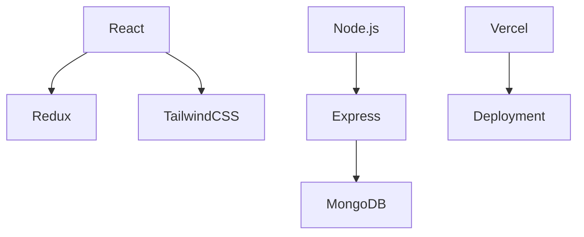
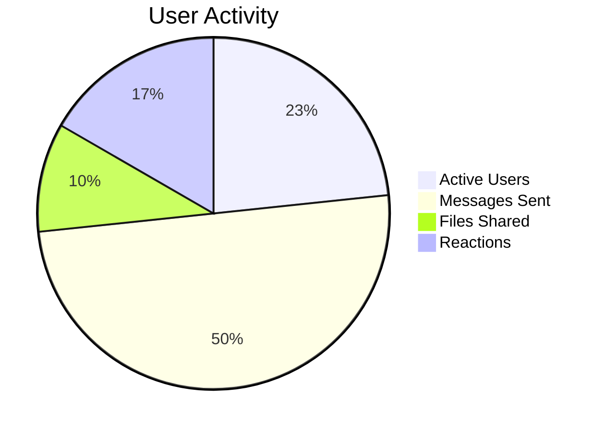

<p align="center">
  
</p>

# 🚀 Chattify - Real-time Chat App

<p align="center">
  
</p>

<p align="center">
  <a href="your_demo_link_here"></a>
  
  
  
  
</p>

## 🌟 Overview
**Chattify** is a modern, real-time chat application built on the **MERN stack**, designed for seamless communication with a sleek and responsive UI.

---

## 🎨 Features at a Glance


---

## 🎥 Demo Preview
<p align="center">
  
</p>

---

## 📊 Tech Stack


---

## 🚀 Getting Started
### Prerequisites
- Install **Node.js** and **MongoDB**

### 🔧 Installation
```bash
git clone https://github.com/your-username/chattify.git
cd chattify
npm install
```

### Setup .env file
```js
MONGODB_URI=...
PORT=5001
JWT_SECRET=...

CLOUDINARY_CLOUD_NAME=...
CLOUDINARY_API_KEY=...
CLOUDINARY_API_SECRET=...

NODE_ENV=development
```

### Build the app
```shell
npm run build
```

### Start the app
```shell
npm start
```

---

## 🖥️ UI Screenshots
<p align="center">
  
  
</p>

---

## 🔥 Code Snippet (Real-time Messaging)
```js
const socket = io("https://yourserver.com");

// Sending a message
const sendMessage = (message) => {
  socket.emit("chatMessage", message);
};

// Receiving messages
socket.on("message", (msg) => {
  console.log(msg);
});
```

---

## 📊 Usage Statistics


---

## 🤝 Contributing
1. Fork the repository
2. Create a new branch (`feature-awesome-thing`)
3. Commit your changes
4. Create a Pull Request

---

## 📩 Contact & Support
📧 Email: [your-email@example.com](mailto:your-email@example.com)  
💬 LinkedIn: [your-profile](your_profile_link_here)  

---

⭐ **Star this repo if you like it!** ⭐
